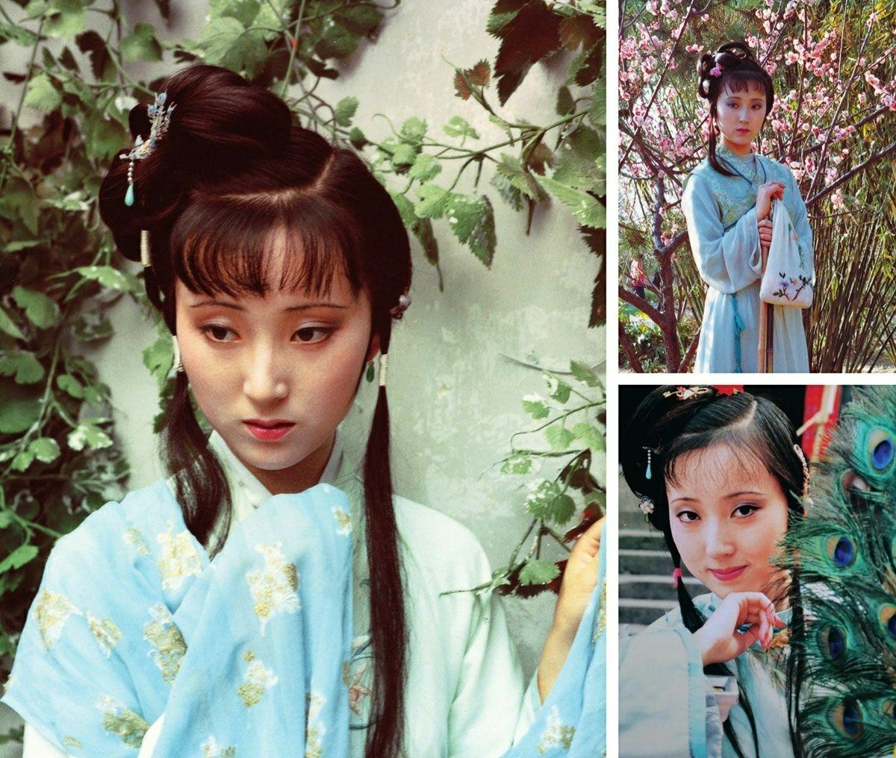

##                    我喜欢红楼梦

​        红楼梦被誉为中国古典小说史上的一部巨著，由曹雪芹所著，讲述了一个以贾家为中心的贵族家庭，庞大宏伟，壮观绝伦。在红楼梦里，有一个最经典的人物贾宝玉。他备受全文的关注，他被称为红楼梦中的主人公，他也是我最喜欢的红楼梦人物。
贾宝玉是宝钗的亲生儿子，贾府的掌管人，同时也是贾母最宠爱
的儿子。他生来就有一副灵性，他有着专横的才华，在诗词方面更是一把好手，他能够轻松地写出九言律诗，是一个有着才华的人。虽然没有接受过正规的文化教育，但他的智慧也令人惊叹，他懂得看不见的东西；他勇敢地反抗苛刻的封建制度，也敢于把自己的自由告诉别人。

​        贾宝玉不仅仅只有才华，他也有脾气。他骄傲、直率；他的言行举止高贵、凝重、贞洁，这表明了他一生的正直坚韧。他为贞洁、爱慕之情而死，令人感动。他勇敢、愤怒、斗争、抗争，他本身即证明了一个人有多么坚强，他也为世人激励着，有多少人通过他而站起来，反抗压迫，担当责任，追求自由与平等。
贾宝玉的故事激励着我们去抗争，勇敢去面对困难，不断地努力，
改变现状，坚持正义，坚守自己的原则，追求自由和平等。他以其坚强勇敢，以及为人正派而铭刻在我们心中，是一个具有人格魅力和高尚境界的人。他用自己的行动告诉我们，人应该做自己应该做的事，以正义、诚实、勇敢为先。贾宝玉无疑是我最喜欢的红楼梦人物，他对我有着极大的启发与感动

